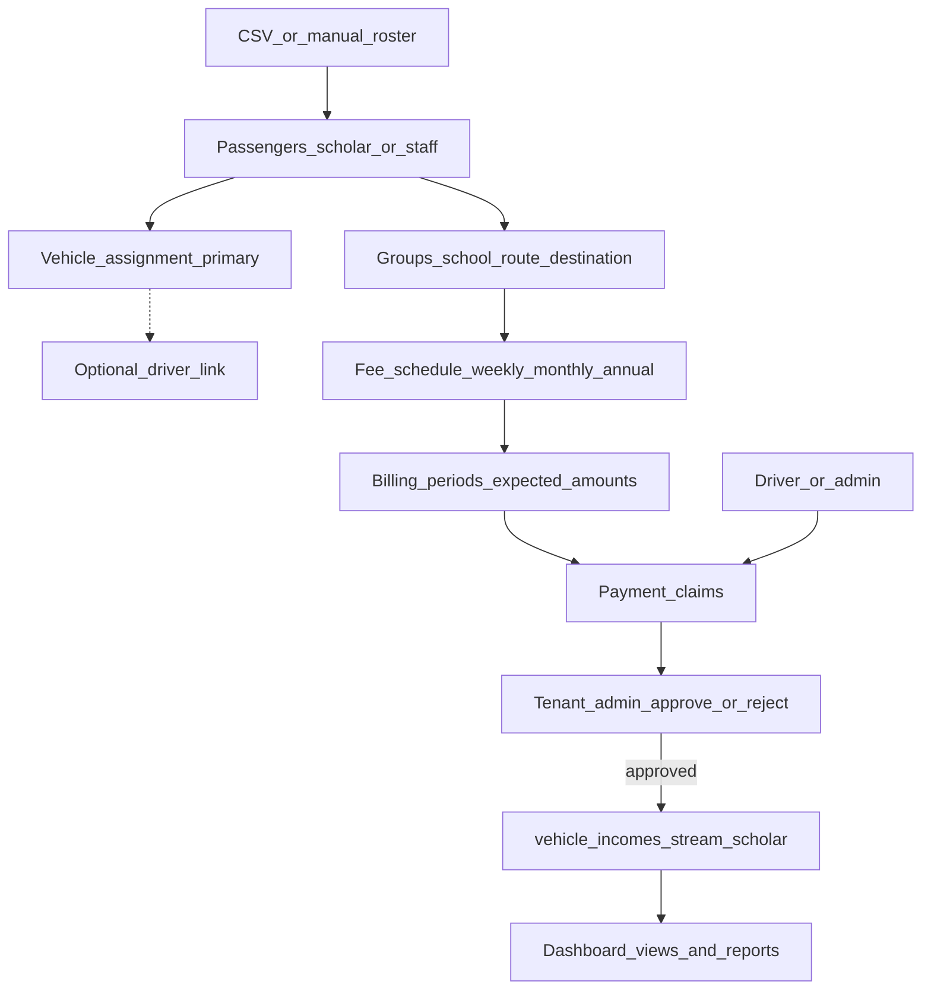

# Scholar / Staff Transport Management Plan
# Scholar / Staff Transport Management Plan

## SA research (what we’re designing for)

South African “scholar transport” has two worlds:

| Model | Who pays | How ops work |
|--------|----------|--------------|
| **Subsidised LTS** (DoT/DBE / provincial contracts) | Government pays operator monthly in arrears against authorised learner registers, km, school days | Learner lists, route contracts, operating licence; often **no parent cash fares** on contracted routes |
| **Private / non-subsidised** (National Learner Transport Policy Class i & ii) | Parents (or employers for staff transport) pay the operator | Door-to-door or pickup-point groups; **weekly / monthly / annual fees**; cash often collected by drivers then reconciled by the owner |

Your description matches **private Class i/ii** (and workplace staff transport): paper/CSV lists, vehicle-based riders, custom schools/routes, fees by period, driver collects → admin vets. **Government subsidy claim packs are out of scope for v1** (can be a later add-on).

Product implications we lock in:

- Track **who is on which vehicle**, not only who paid.
- Track **arrears by billing period**.
- Treat **driver-collected money as unverified** until tenant-admin approves.
- Keep scholar/staff revenue **analytically separate** from meter/day-to-day income, with views for day-to-day / scholar / both.

---

## Current VIT baseline (do not rebuild from zero blindly)

Already present but incomplete:

- Entitlement `scholar_payments` (Pro plan); nav to `/scholar-payments`
- Thin table `scholar_payments` + UI stub; **no Nest module/API**
- `vehicle_incomes.income_stream` (`general` | `trip` | `scholar`) + `scholar_payment_id` columns exist, but incomes API **does not persist** them
- Flutter only has an unused `fetchScholarPayments()` stub

Plan: **replace the stub payment table with a proper domain model**, wire API + tenant-admin, and use `income_stream = scholar` only when a payment is **approved**.

---

## Product model

### Core entities (per-tenant schema)

1. **`transport_passengers`** (scholars + staff)
   - `type`: `scholar` | `staff`
   - identity: name, guardian/employer contact, phone, notes, `is_active`
   - **primary** `vehicle_id` (required when active)
   - optional `driver_user_id` (informational; survives driver swaps — vehicle stays source of truth)
   - optional `group_id`

2. **`transport_groups`**
   - custom label: school / route / destination / workplace
   - `kind`: `school` | `route` | `destination` | `other`
   - default fee: `amount`, `cadence` (`weekly` | `monthly` | `annual`), optional `due_day`
   - passengers inherit fee unless overridden on the passenger

3. **`transport_assignments`** (history)
   - passenger ↔ vehicle (and optional driver) with `effective_from` / `effective_to`
   - supports “moved to another vehicle” without losing history

4. **`transport_billing_periods`**
   - generated or created for a date range (e.g. Sep 2026 month, or week starting Mon)
   - per passenger (or per group batch): `expected_amount`, `status` derived from payments

5. **`transport_payment_claims`** (replaces stub `scholar_payments`)
   - amount, method (`cash` | `eft` | `other`), paid_at, notes, proof URL optional
   - `submitted_by` (driver or admin), `status`: `pending` | `approved` | `rejected`
   - links: `passenger_id`, `billing_period_id`, `vehicle_id` (snapshot at claim time)
   - on **approve**: create/update `vehicle_incomes` row with `income_stream='scholar'`, link claim id; audit log
   - on **reject**: no income; reason required
   - **partial payments** allowed (sum of approved claims vs expected → paid / partial / overdue)

6. **CSV import jobs**
   - upload roster → preview → commit
   - columns (v1): `name`, `type`, `vehicle_reg`, `group_name`, `fee_amount`, `cadence`, `guardian_or_contact`, `phone`, `driver_email` (optional)

### Money separation rules (locked)

- Day-to-day ops income stays `income_stream = general` (default).
- Scholar/staff fees **never** auto-mix into general; only approved claims post as `scholar`.
- Reports and dashboard filters:
  - **Operations** → `general` (+ `trip` if used)
  - **Transport** → `scholar` only
  - **Combined** → all streams
- Same filter pattern on incomes list, vehicle income detail, and (later) trips list: Operations / Transport / Both.

---

## Tenant-admin UX (main surface)

New nav section under entitlement `scholar_payments` (rename UI label to **Scholar & staff transport**):

| Page | Purpose |
|------|---------|
| **Passengers** | CRUD, filter by vehicle/group/arrears; move vehicle; CSV import |
| **Groups** | Schools/routes/destinations + default fees |
| **Payments** | Pending queue (approve/reject); history; period filter “who paid / who owes” |
| **Transport reports** | Vehicle transport revenue; group collection rate; arrears ageing |
| **Dashboard** | Toggle: Operations \| Transport \| Combined |

Replace thin [`tenant-admin/src/app/scholar-payments/page.tsx`](tenant-admin/src/app/scholar-payments/page.tsx) with this module (redirect old route).

**Arrears view (your core ask):** for selected period → each passenger: expected, paid (approved), balance, status. Export CSV.

---

## Payment capture (Phase 1 = tenant-admin only)

- Admin records payment claims (can attribute “collected by driver X”).
- Admin self-entry can **auto-approve** with audit, or stay pending if marked as driver-collected for a second pair of eyes.
- **Flutter driver submit is deferred** (Phase 1b) — API shapes can still reserve `submitted_by` for later.

**Approval:** tenant-admin only (`TENANT_ADMIN` / SYS impersonation).

---

## API (Nest)

New module `api/src/modules/tenant-transport/` (name avoids clashing with stub), guarded with `@RequiresModule('scholar_payments')`:

- CRUD passengers, groups, assignments
- `POST /tenant/transport/passengers/import` (CSV)
- `GET /tenant/transport/periods` + generate periods
- `GET /tenant/transport/arrears?from=&to=` 
- `POST /tenant/transport/payments` (driver/admin claim)
- `POST /tenant/transport/payments/:id/approve|reject`
- Reports: `GET /tenant/transport/reports/by-vehicle`, `by-group`, `summary`

Wire incomes: extend [`tenant-income.entity.ts`](api/src/modules/tenant-incomes/tenant-income.entity.ts) + create DTO to persist `incomeStream`, `scholarPaymentId` (or new claim id). Migrate stub `scholar_payments` → new tables (data migration if any rows exist).

---

## Dashboard & incomes / trips views

- Dashboard widgets split by stream (reuse existing income aggregation; fix stream persistence first).
- Incomes page: stream filter chips Operations / Transport / Both (already has a stream column UI).
- Trips page: keep free-text `trip_type`; add filter `scholar` vs other for “transport trips” view without merging money into general income.
- Dedicated **Transport reports** page for collection %, arrears, vehicle transport-only totals.

---

## Committed scope: Phase 1 only

User locked **Phase 1**. Phase 1b (Flutter) and Phase 2 are **deferred** — documented below for later, not built now.

### Phase 1 — build this

- Schema + migration; Nest CRUD; CSV import; groups + fees; vehicle assignment + move history
- Billing periods + arrears “who paid this month” (+ grace/overdue)
- Payment claims + admin approve/reject → posts `income_stream=scholar` + audit
- Household/sibling link; school-calendar fee pause; driver collection summary; soft seat-capacity warn
- Tenant-admin passengers / groups / payments / arrears + dashboard stream toggle
- Transport reports by vehicle/group; incomes/trips Operations | Transport | Combined filters
- Enforce entitlement on API

Phase 1 extras (from recommendations, included):

1. School calendar fee pause  
2. Household / sibling link  
3. Grace days + overdue  
4. Driver collection summary (admin view of attributed collections)  
5. Soft seat-capacity warn  
6. Immutable audit on approve/reject  

### Deferred — Phase 1b (not now)

- Flutter: list passengers on assigned vehicle; submit payment claim; see pending/approved

### Deferred — Phase 2 (not now)

- Receipts/PDF; WhatsApp/SMS arrears nudges; proof photo; bulk approve  
- Pickup-point list; term billing; suspend-for-non-payment  
- LTS register export / licence reminders  

---

## Out of scope (this build)

- Flutter driver payment UI (Phase 1b)
- Phase 2 hardening items above
- Parent-facing portal / online card payments
- Subsidised provincial claim workflows
- Live GPS attendance / boarding scans
- Auto-linking day-to-day trip fares into scholar fees

---

## Delivery of this plan

After you approve / say execute: save as [`docs/VIT-Scholar-Staff-Transport-Plan.md`](docs/VIT-Scholar-Staff-Transport-Plan.md), email **neanimakhari7@gmail.com**, then implement **Phase 1 only**.
